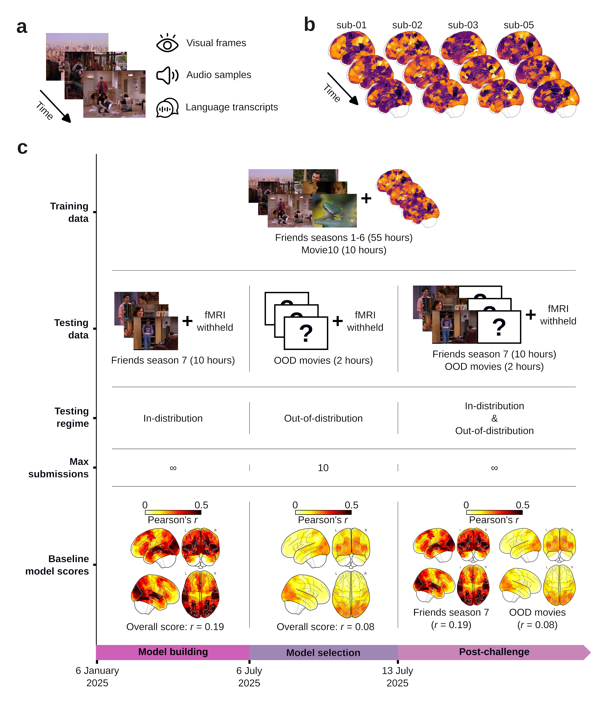

# The Algonauts Project 2025 Challenge


This GitHub repository contains data and code for the Algonauts Project 2025 challenge. If you experience problems with the data or code, please get it touch with the Algonauts Team at (algonauts.mit@gmail.com).


## Overview

### The Algonauts Project

The [Algonauts Project](https://algonautsproject.com/), first launched in 2019, is on a mission to bring biological and machine intelligence researchers together on a common platform to exchange ideas and pioneer the intelligence frontier. Inspired by the astronauts' exploration of space, "algonauts" explore biological and artificial intelligence with state-of-the-art algorithmic tools, thus advancing both fields.

### The 2025 challenge

Encoding models of neural responses are increasingly used as predictive and explanatory tools in computational neuroscience ([Kay et al., 2008](https://doi.org/10.1038/nature06713); [Kell et al., 2018](https://doi.org/10.1016/j.neuron.2018.03.044); [Kriegeskorte and Douglas, 2019](https://doi.org/10.1016/j.conb.2019.04.002); [Naselaris et al., 2011](https://doi.org/10.1016/j.neuroimage.2010.07.073); [Tuckute et al., 2023](https://doi.org/10.1371/journal.pbio.3002366); [Van Gerven, 2017](https://doi.org/10.1016/j.jmp.2016.06.009); [Wu et al., 2006](https://doi.org/10.1146/annurev.neuro.29.051605.113024); [Yamins and DiCarlo, 2016](https://doi.org/10.1038/nn.4244)). They consist of algorithms, typically based on deep learning architectures, that take stimuli as input, and output the corresponding neural activations, effectively modeling how the brain responds to (i.e., encodes) these stimuli. Thus, the goal of the 2025 challenge is to provide a platform for biological and artificial intelligence scientists to cooperate and compete in developing cutting-edge functional magnetic resonance imaging (fMRI) encoding models. Specifically, these models should predict fMRI response to multimodal naturalistic movies, and generalize outside their training distribution.

The challenge is based on data from the Courtois Project on Neuronal Modelling ([CNeuroMod](https://www.cneuromod.ca/)), which has acquired the dataset that, to date, most intensively samples single-subject fMRI responses to a variety of naturalistic tasks, including movie watching. For more details on the challenge you can visit the [website](https://algonautsproject.com/), read the [preprint](!!!), or watch [this video](!!!).

### Challenge phases

The challenge consists of three phases:
* **Model building phase (6 months, January 6 2025 - July 6 2025):** During the model building phase, participants will train and test their encoding models using movie stimuli and fMRI responses from the same distribution. For model training, we provide movie stimuli and corresponding fMRI responses for all episodes of seasons 1 to 6 of the sitcom Friends. We also provide movie stimuli and corresponding fMRI responses from the Movie10 dataset which includes four movies. For model testing, we provide movie stimuli for all episodes of seasons 7 of Friends, and withhold the corresponding fMRI responses. Challenge participants can test their encoding models by submitting predicted fMRI responses for Friends season 7 (unlimited submissions).
* **Model selection phase (1 week, July 6 2025 - July 13 2025):** During the model selection phase, the winning models will be selected based on the accuracy of their predicted fMRI responses for out-of-distribution (OOD) movie stimuli. Out-of-distribution (OOD) movie stimuli will be provided, while the corresponding fMRI responses will be withheld. The nature of the OOD movie stimuli will be revealed at the beginning of the model selection phase. Participants can submit their encoding model’s predicted fMRI responses for the OOD movie stimuli to Codabench (maximum ten submissions).
* **Post-Challenge phase (indefinite, from July 13 2025):** After the challenge, we will open an indefinite post-challenge phase, which will serve as a public benchmark. This benchmark will consist of two separate leaderboards that will rank encoding models based on their fMRI predictions for in-distribution (Friends season 7) or out-of-distribution (OOD movies) multimodal movie stimuli, respectively.

### Challenge development kit

To facilitate participation, we provide a [development kit](https://colab.research.google.com/drive/1fop0zvaLBLBagvJRC-HDqGDSgQElNWZB?usp=sharing) in Python which accompanies users through the challenge process, following four steps:
1. Familiarizing with the challenge data.
2. Extracting the stimulus features used to train and validate an fMRI encoding model.
3. Training and validating an fMRI encoding model.
4. Preparing the predicted fMRI responses for the test stimuli in the correct format to submit to [Codabench](https://www.codabench.org/competitions/4313/).

You can run this tutorial either on [Colab](https://colab.research.google.com/drive/1fop0zvaLBLBagvJRC-HDqGDSgQElNWZB?usp=sharing), or on [Jupyter Notebook](https://github.com/courtois-neuromod/algonauts_2025.competitors/tree/main/tutorial/algonauts_2025_challenge_tutorial.ipynb).

### Challenge Rules

1. Challenge participants can use any encoding model derived from any source and trained on any type of data. However, using recorded brain responses for Friends season 7 or the OOD movie stimuli is prohibited.
2. Challenge participants can make an unlimited number of submissions during the model building phase, and a maximum of ten submissions during the model selection phase (the leaderboard of each phase is automatically updated after every submission). Each challenge participant can only compete using one account. Creating multiple accounts to increase the number of possible submissions will result in disqualification to the challenge.
3. The winning models will be determined based on their performance in predicting fMRI responses for the OOD movie stimuli during the model selection phase.
4. To promote open science, challenge participants who wish to be considered for the winners selection will need to submit a short report (~4-8 pages) describing their encoding algorithm to a preprint server (e.g. arXiv, bioRxiv), and send the PDF or preprint link to the Organizers by filling out [this form](https://forms.gle/RbouWUqYrm9pcWMXA). You must submit the challenge report by the challenge report submission deadline to be considered for the evaluation of the challenge outcome. Furthermore, while all reports are encouraged to link to their code (e.g. GitHub), the top-3 performing teams are required to make their code openly available. Participants that do not make their approach open and transparent cannot be considered. Along with monetary prizes, the top-3 performing teams will be invited to present their encoding models during a talk at the [Cognitive Computational Neuroscience (CCN)](https://2025.ccneuro.org/) conference held in Amsterdam (Netherlands) in August 2025.

### Challenge resources

- [Website](https://algonautsproject.com/)
- [Paper]
- [Data](https://forms.gle/kmgYdxR92H4nUBfH7)
- [Challenge Development Kit Tutorial](https://colab.research.google.com/drive/1fop0zvaLBLBagvJRC-HDqGDSgQElNWZB?usp=sharing)
- [Codabench Challenge Submission Page](https://www.codabench.org/competitions/4313/)
- [Challenge Overview Video]
- [Development Kit Tutorial Walkthrough Video]
- [Codabench Submission Walkthrough Video]
- [CNeuroMod](https://www.cneuromod.ca/)

### Citation

If you use any of the resources provided for the Algonauts Project 2025 challenge, please cite the following papers:

> * Gifford AT, Bersch D, St-Laurent M, Pinsard B, Boyle J, Bellec L, Oliva A, Roig G, Cichy RM. 2025. The Algonauts Project 2025 Challenge: How the Human Brain Makes Sense of Multimodal Movies. _arXiv preprint_, arXiv:???. DOI: [https://doi.org/???](!!!)
> * Boyle J, Pinsard B, Borghesani V, Paugam F, DuPre E, Bellec P. 2023. The Courtois NeuroMod project: quality assessment of the initial data release (2020). _2023 Conference on Cognitive Computational Neuroscience_.


## Data



### Data overview

The [`stimuli`](https://github.com/courtois-neuromod/algonauts_2025.competitors/tree/main/stimuli) and [`fmri`](https://github.com/courtois-neuromod/algonauts_2025.competitors/tree/main/fmri) folders contain the dataset of the Algonauts Project 2025 challenge.

For a demonstration of how to use the challenge data to train and evaluate encoding models of the brain, please see the challenge [development kit](https://colab.research.google.com/drive/1fop0zvaLBLBagvJRC-HDqGDSgQElNWZB?usp=drive_link).

#### Model building phase (6 months, January 6 2025 - July 6 2025)

During this first phase, you will train and test encoding models using movie stimuli and fMRI responses from the same distribution.

- **Model Training.** For model training, we provide 55 hours of movie stimuli and corresponding fMRI responses for each of the four subjects for all episodes of seasons 1 to 6 of the sitcom *Friends*. We also provide 10 hours of movie stimuli and corresponding fMRI responses from the *Movie10* dataset for which the same four subjects watched the following four movies: *The Bourne Supremacy*, *Hidden Figures*, *Life* (a BBC nature documentary), and *The Wolf of Wall Street*. Each movie was presented to each subject once, except for *Life* and *Hidden Figures* which were presented twice. You can train their encoding models using these data.
- **Model Testing.** For model testing, we provide 10 hours of movie stimuli for all episodes of seasons 7 of the Friends dataset, and withhold the corresponding fMRI responses for each subject. You can test your encoding models against the withheld fMRI responses by submitting predicted fMRI responses for Friends season 7 to [Codabench](https://www.codabench.org/competitions/4313/).

#### Model selection phase (1 week, July 6 2025 - July 13 2025)

During this second phase, the winning models will be selected based on the accuracy of their predicted fMRI responses for withheld out-of-distribution (OOD) movie stimuli.

- **Model Testing.** At the beginning of the model selection phase, we will provide 2 hours of OOD movie stimuli and withhold the corresponding fMRI responses for each of the four subjects. The nature of the OOD movie stimuli will not be revealed until the beginning of the model selection phase. To participate in the winners selection process, you can submit your encoding model's predicted fMRI responses for the OOD movie stimuli to [Codabench](https://www.codabench.org/competitions/4313/).

### Data description

#### Stimuli

The multimodal (**audio**, **visual** and **language**) stimuli of the Algonauts 2025 challenge consist of `.mkv` files of audiovisual movies, and of `.tsv` files that contain corresponding timestamped movie transcripts.

##### .mkv files (audiovisual movie stimuli)

The `.mkv` files consist of movies that combine the visual and audio modalities, for seasons 1 to 7 of Friends and for Movie10.

###### Friends (seasons 1-7)

The `.mkv` files for seasons 1 to 7 of Friends are found at `../stimuli/movies/friends/s<season>/`, and have the naming convention `friends_s-<season>e<episode><episode_split>.mkv`, where:
- **`season`:** Number indicating the Friends season.
- **`episode`:** Number indicating the Friends episode.
- **`episode_split`:** Full episodes were split into shorter (~12 min) segments watched by participants inside the MRI in order to reduce the duration of fMRI data acquisition runs. Letters indicate the split of each episode. Most Friends episodes are split into two parts (i.e., splits `a` and `b`), but a handful of longer episodes are split into four parts (i.e., splits `a`, `b`, `c` and `d`).

###### Movie10

The `.mkv` files for Movie10 are found at `../stimuli/movies/movie10/<movie>/`, and have the naming convention `<movie><movie_split>.mkv`, where:
- **`movie`:** String indicating the movie name.
- **`movie_split`:** Number indicating the movie split. Each movie was split into several segments to limit the duration of consecutive fMRI data acquisition runs.

##### .tsv files (timestamped movie transcripts)

The `.tsv` files contain the timestamped movie transcripts, that is, transcripts of spoken content (dialogue) in the movie stimuli, for seasons 1 to 7 of Friends and for Movie10.

###### Friends (seasons 1-7)

The `.tsv` files for seasons 1 to 7 of Friends are found at `../stimuli/transcripts/friends/s<season>/`, and have the naming convention `friends_s-<season>e<episode><episode_split>.tsv`, where:
- **`season`:** Number indicating the Friends season.
- **`episode`:** Number indicating the Friends episode.
- **`episode_split`:** Letter indicating the split of the episode. Most Friends episodes are split into two parts (i.e., splits `a` and `b`), but a handful of longer episodes are split into four parts (i.e., splits `a`, `b`, `c` and `d`).

###### Movie10

The `.tsv` files for Movie10 are found at `../stimuli/transcripts/movie10/<movie>/`, and have the naming convention `movie10_<movie><movie_split>.tsv`, where:
- **`movie`:** String indicating the movie name.
- **`movie_split`:** Number indicating the movie split.

###### .tsv file content

The `.tsv` files splits transcribed movie dialogue into chunks of 1.49 seconds, where each **row** of the `.tsv` file corresponds to one such chunk. This segmentation was performed to facilitate alignment with the fMRI data, since fMRI volumes were acquired with a repetition time (TR) of 1.49 seconds (that is, one fMRI sample was acquired every 1.49 seconds). If no words were spoken during a specific chunk, the corresponding `.tsv` file row will be empty.

The **columns** of the `.tsv` files consist of
different attributes of the language transcripts:
- **`text_per_tr`:** Sentence consisting of words that were spoken during the chunk of interest (i.e., words with word offset within the chunk of interest, even if their onset was in the previous chunk).
- **`words_per_tr`:** List of individual words that were spoken during the chunk of interest.
- **`onsets_per_tr`:** Starting time (in seconds) of each word spoken during the chunk, relative to movie onset.
- **`durations_per_tr`:** Duration (in seconds) of each word spoken during the chunk.


#### fMRI

The Algonauts 2025 Challenge uses fMRI data from four [CNeuromod](https://www.cneuromod.ca/) subjects (`sub-01`, `sub-02`, `sub-03` and `sub-05`). For each subject, the data include fMRI responses to each movie, brain atlases, and the number of samples (in chunks of 1.49s) for the withheld fMRI responses to the test movie stimuli.

##### fMRI responses

The fMRI responses are found at `../fmri/sub-0X/func/`. They consist of whole-brain fMRI responses to
seasons 1 to 6 of Friends and to Movie10 for four subjects. These fMRI responses are normalized to the Montreal Neurologcal Institute (MNI) spatial template ([Brett et al., 2002](https://doi.org/10.1038/nrn756)), processed as time series whose signal is assigned to 1,000 functionally defined brain parcels ([Schaefer et al., 2018](https://doi.org/10.1093/cercor/bhx179)), and saved in `.h5` files (one file for Friends season 1-6 and one for Movie10 for each subject).

Each `.h5` file consists of multiple fMRI datasets, corresponding to different movie segments, where every dataset consists of a 2D array of shape `(N samples, 1,000 parcels)`. Since the fMRI responses were collected with a repetition time (TR) of 1.49 seconds, one fMRI sample was recorded every 1.49 seconds worth of movie watching.

###### Friends (seasons 1-6)

For fMRI responses to Friends, the datasets within the `.h5` files have the following naming convention `ses-<recording_session>_task-s<season>e<episode><episode_split>`, where:
- **`recording_session`:** Number indicating the fMRI recording session (data were acquired over multiple scanning sessions spread across multiple days).
- **`season`:** Number indicating the Friends season.
- **`episode`:** Number indicating the Friends episode.
- **`episode_split`:** Letter indicating the split of the episode. Most Friends episodes are split into two parts (i.e., splits `a` and `b`), but a handful of longer episodes are split into four parts (i.e., splits `a`, `b`, `c` and `d`).

<font color='red'><b>NOTE:</b></font> most, but not all Friends episodes were presented according to the series order (for example, fMRI responses for episode 1 of season 1 were collected during the second or third recording session).

<font color='red'><b>MISSING fMRI DATA:</b></font>
* Subject 2 is missing `s05e20a`.
* Subject 5 is missing `s04e01a`, `s04e01b` and `s04e13b`.

###### Movie10

For fMRI responses to Movie10, fMRI datasets were saved within `.h5` files (one per subject) according to the naming convention `ses-<recording_session>_task-<movie><movie_split>_run-<run_number>`, where:
- **`recording_session`:** Number indicating the fMRI recording session (movie splits were acquired over multiple sessions spread over many days).
- **`movie`:** String indicating the movie name.
- **`movie_split`:** Number indicating the movie split.
- **`run_number`:** Number (`1` or `2`) indicating whether the movie was presented for the first or second time. Only applies to datasets for movies *Life* and *Hidden figures*, since these two movies were presented twice to each subject (whereas all other movies were only presented once).

##### MRI atlases

The MRI atlases are found at `../fmri/sub-0X/atlas/`. They were used to assign whole-brain fMRI signal to 1,000 functionally defined brain parcels from the Schaefer brain atlas ([Schaefer et al., 2018](https://doi.org/10.1093/cercor/bhx179)). Subject-specific atlases can be used to project a subject's 1,000 parcel-wise data (e.g., fMRI responses, Pearson's $r$ scores) back into a 3D brain volume space for plotting.

Each atlas file is a 3D array of shape of `(97 voxels, 115 voxels, 97 voxels)`, where each brain voxel is assigned a parcel ID between 1 and 1,000; zeros represent areas outside the brain.

##### fMRI sample number for the test movie stimuli

These files are found at `../fmri/sub-0X/target_samples_number/`, and indicate the number of fMRI response samples in each timeseries from Friends season 7 for each subject. These fMRI timeseries are withheld to test model accuracy throughout the Model Building phase, but the number of samples per timeseries is disclosed for each subject. You will use these files in tutorial `Section 4` to learn how to prepare challenge submissions.

### Data download

#### Terms

The CNeuroMod data used in the Algonauts 2025 Challenge has been openly shared under a [Creative Commons CC0 license](https://creativecommons.org/public-domain/cc0/) by a subset of CNeuroMod participants through the Canadian Open Neuroscience Platform (CONP), funded by Brain Canada and based at McGill University, Canada. Participants provided informed consent both to participate in the CNeuroMod study conducted at CIUSSS du Centre-Sud-de-l’île-de-Montréal and, separately, to share their data through the CONP. The CC0 license enables the Algonauts 2025 team to freely create and distribute derivative works, without restrictions, and the Algonauts 2025 challenge data is likewise distributed under a CC0 license.

By downloading and using the Algonauts Project 2025 challenge data, **you confirm that you are 18 or older**, and you understand that the content of certain challenge movie stimuli might be disturbing to some viewers.

#### Install DataLad

To download the challenge data you first need to install [`DataLad`](https://www.datalad.org/), a tool for versioning large data structures in a git repository available for Linux, OSX and Windows.

#### Install the dataset

Once you have `DataLad`, you can use it to install the Algonauts 2025 challenge repository using:

```shell
datalad install -r git@github.com:courtois-neuromod/algonauts_2025.competitors.git
```

#### Download the challenge dataset

To download the data, first change directory to the challenge respository you just installed:

```shell
cd algonauts_2025.competitors
```

You can now download the challenge dataset using the `datalad get` command:

```shell
datalad get -r -J8 .
```

where:

- **`-r` :** recursive flag, to recursively download all subdatasets.
- **`-J8` :** how many parallel jobs to use for downloaded the dataset (here is it 8).
- **`.` :** tells the `datalad get` command to act on the current directory and its contents.

You can also download subdatasets of the challenge dataset, by giving the corresponding path as input to `datalad get`. For example, you can download ony subject's 1 fMRI responses using:

```shell
datalad get -r -J8 fmri/sub-01/*
```


## Code

### fMRI preprocessing

The [`../code/cneuromod_extract_tseries`](https://github.com/courtois-neuromod/cneuromod_extract_tseries/tree/ff31d12b8421c931e39cabcbb55339da1e9f073d) folder contains the code used to preprocess [CNeuroMod](https://www.cneuromod.ca/)'s raw fMRI responses used in the challenge.

### Challenge baseline encoding model

The [`../code/challenge_baseline_model`](https://github.com/courtois-neuromod/algonauts_2025.competitors/tree/main/code/challenge_baseline_model) folder contains code used to build the challenge baseline encoding model, divided in the following sub-folders:

* **[`../01_stimulus_feature_extraction/`](https://github.com/courtois-neuromod/algonauts_2025.competitors/tree/main/code/challenge_baseline_model/01_stimulus_feature_extraction):** extract the stimulus features used to train the encoding models.
* **[`../02_encoding_model_training/`](https://github.com/courtois-neuromod/algonauts_2025.competitors/tree/main/code/challenge_baseline_model/02_encoding_model_training):** train the encoding models, and save their weights.
* **[`../03_encoding_model_testing/`](https://github.com/courtois-neuromod/algonauts_2025.competitors/tree/main/code/challenge_baseline_model/03_encoding_model_testing):** test the encoding models.

To run this code, you will first need to install [these libraries](https://github.com/courtois-neuromod/algonauts_2025.competitors/blob/main/requirements.txt).
