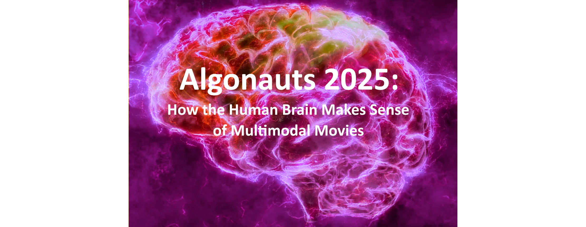

# The Algonauts Project 2025 Challenge



This GitHub repository contains data and code for the Algonauts Project 2025 challenge. If you experience problems with the data or code, please get it touch with the Algonauts Team at (algonauts.mit@gmail.com).


## Overview

### The Algonauts Project

The [Algonauts Project](https://algonautsproject.com/), first launched in 2019, is on a mission to bring biological and machine intelligence researchers together on a common platform to exchange ideas and pioneer the intelligence frontier. Inspired by the astronauts' exploration of space, "algonauts" explore biological and artificial intelligence with state-of-the-art algorithmic tools, thus advancing both fields.

### The 2025 challenge

Encoding models of neural responses are increasingly used as predictive and explanatory tools in computational neuroscience ([Kay et al., 2008](https://doi.org/10.1038/nature06713); [Kell et al., 2018](https://doi.org/10.1016/j.neuron.2018.03.044); [Kriegeskorte and Douglas, 2019](https://doi.org/10.1016/j.conb.2019.04.002); [Naselaris et al., 2011](https://doi.org/10.1016/j.neuroimage.2010.07.073); [Tuckute et al., 2023](https://doi.org/10.1371/journal.pbio.3002366); [Van Gerven, 2017](https://doi.org/10.1016/j.jmp.2016.06.009); [Wu et al., 2006](https://doi.org/10.1146/annurev.neuro.29.051605.113024); [Yamins and DiCarlo, 2016](https://doi.org/10.1038/nn.4244)). They consist of algorithms, typically based on deep learning architectures, that take stimuli as input, and output the corresponding neural activations, effectively modeling how the brain responds to (i.e., encodes) these stimuli. Thus, the goal of the 2025 challenge is to provide a platform for biological and artificial intelligence scientists to cooperate and compete in developing cutting-edge functional magnetic resonance imaging (fMRI) encoding models. Specifically, these models should predict fMRI response to multimodal naturalistic movies, and generalize outside their training distribution.

The challenge is based on data from the Courtois Project on Neuronal Modelling ([CNeuroMod](https://www.cneuromod.ca/)), which has acquired the dataset that, to date, most intensively samples single-subject fMRI responses to a variety of naturalistic tasks, including movie watching. For more details on the challenge you can visit the [website](https://algonautsproject.com/), read the [preprint](!!!), or watch [this video](!!!).

### Challenge phases

The challenge consists of three phases:
* **Model building phase:** During the model building phase you will train and test your encoding models using movie stimuli and fMRI responses from the same distribution.
* **Model selection phase:** During the model selection phase the winning models will be selected based on the accuracy of their predicted fMRI responses for out-of-distribution (OOD) movie stimuli.
* **Post-Challenge phase:** After the challenge we will open an indefinite post-challenge phase, which will serve as a public benchmark. This benchmark will consist of two separate leaderboards that will rank encoding models based on their fMRI predictions for in-distribution (Friends season 7) or out-of-distribution (OOD movies) multimodal movie stimuli, respectively.

### Challenge development kit

To facilitate participation, we provide a [development kit](https://colab.research.google.com/drive/1fop0zvaLBLBagvJRC-HDqGDSgQElNWZB?usp=sharing) in Python which accompanies users through the challenge process, following four steps:
1. Familiarizing with the challenge data.
2. Extracting the stimulus features used to train and validate an fMRI encoding model.
3. Training and validating an fMRI encoding model.
4. Preparing the predicted fMRI responses for the test stimuli in the correct format for submission to [Codabench](https://www.codabench.org/competitions/4313/).

### Challenge Rules

1. Challenge participants can use any encoding model derived from any source and trained on any type of data. However, using recorded brain responses for Friends season 7 or the OOD movie stimuli is prohibited.
2. Challenge participants can make an unlimited number of submissions during the model building phase, and a maximum of ten submissions during the model selection phase (the leaderboard of each phase is automatically updated after every submission). Each challenge participant can only compete using one account. Creating multiple accounts to increase the number of possible submissions will result in disqualification to the challenge.
3. The winning models will be determined based on their performance in predicting fMRI responses for the OOD movie stimuli during the model selection phase.
4. To promote open science, challenge participants who wish to be considered for the winners selection will need to submit a short report (~4-8 pages) describing their encoding algorithm to a preprint server (e.g. arXiv, bioRxiv), and send the PDF or preprint link to the Organizers by filling out [this form](https://forms.gle/RbouWUqYrm9pcWMXA). You must submit the challenge report by the challenge report submission deadline to be considered for the evaluation of the challenge outcome. Furthermore, while all reports are encouraged to link to their code (e.g. GitHub), the top-3 performing teams are required to make their code openly available. Participants that do not make their approach open and transparent cannot be considered. Along with monetary prizes, the top-3 performing teams will be invited to present their encoding models during a talk at the [Cognitive Computational Neuroscience (CCN)](https://2025.ccneuro.org/) conference held in Amsterdam (Netherlands) in August 2025.

### Challenge resources

- [Website](https://algonautsproject.com/)
- [Paper]
- [Data](https://forms.gle/kmgYdxR92H4nUBfH7)
- [Challenge Development Kit Tutorial](https://colab.research.google.com/drive/1fop0zvaLBLBagvJRC-HDqGDSgQElNWZB?usp=sharing)
- [Codabench Challenge Submission Page](https://www.codabench.org/competitions/4313/)
- [Challenge Overview Video]
- [Development Kit Tutorial Walkthrough Video]
- [Codabench Submission Walkthrough Video]
- [CNeuroMod](https://www.cneuromod.ca/)

### Citations

If you use any of the resources, data or code provided for the Algonauts Project 2025 challenge, please cite the following papers:

> * Gifford AT, Bersch D, St-Laurent M, Pinsard B, Boyle J, Bellec L, Oliva A, Roig G, Cichy RM. 2025. The Algonauts Project 2025 Challenge: How the Human Brain Makes Sense of Multimodal Movies. _arXiv preprint_, arXiv:???. DOI: [https://doi.org/???](!!!)
> * CNeuroMod paper?


## Data


### Data overview 

The [`stimuli`](https://github.com/courtois-neuromod/algonauts_2025.competitors/tree/main/stimuli) and [`fmri`](https://github.com/courtois-neuromod/algonauts_2025.competitors/tree/main/fmri) folders contain the dataset of the Algonauts Project 2025 challenge.

For a demonstration of how to use the challenge data to train and evaluate encoding models of the brain, please see the challenge [development kit](https://colab.research.google.com/drive/1fop0zvaLBLBagvJRC-HDqGDSgQElNWZB?usp=drive_link).

#### Model building phase

During this first phase, you will train and test encoding models using movie stimuli and fMRI responses from the same distribution.

- **Model Training.** For model training, we provide 55 hours of movie stimuli and corresponding fMRI responses for each of the four subjects for all episodes of seasons 1 to 6 of the sitcom *Friends*. We also provide 10 hours of movie stimuli and corresponding fMRI responses from the *Movie10* dataset for which the same four subjects watched the following four movies: *The Bourne Supremacy*, *Hidden Figures*, *Life* (a BBC nature documentary), and *The Wolf of Wall Street*. Each movie was presented to each subject once, except for *Life* and *Hidden Figures* which were presented twice. You can train their encoding models using these data.
- **Model Testing.** For model testing, we provide 10 hours of movie stimuli for all episodes of seasons 7 of the Friends dataset, and withhold the corresponding fMRI responses for each subject. You can test your encoding models against the withheld fMRI responses by submitting predicted fMRI responses for Friends season 7 to [Codabench](https://www.codabench.org/competitions/4313/).

#### Model selection phase

During this second phase, the winning models will be selected based on the accuracy of their predicted fMRI responses for withheld out-of-distribution (OOD) movie stimuli.

- **Model Testing.** At the beginning of the model selection phase, we will provide 2 hours of OOD movie stimuli and withhold the corresponding fMRI responses for each of the four subjects. The nature of the OOD movie stimuli will not be revealed until the beginning of the model selection phase. To participate in the winners selection process, you can submit your encoding model's predicted fMRI responses for the OOD movie stimuli to [Codabench](https://www.codabench.org/competitions/4313/).

### Data description 

#### Stimuli !!!!!!!!!!!!!!!!!!!!!!!!!!!!!!!!

The stimuli consist of movie visual frames, audio samples, and time-stamped language transcripts.

- What the data is (stimuli description)
- Data info from Obsidian and tutorial


#### fMRI !!!!!!!!!!!!!!!!!!!!!!!!!!!!!!!!

The fMRI data consist of whole-brain responses for four CNeuroMod subjects (sub-01, sub-02, sub-03 and sub-05), normalized to the Montreal Neurological Institute (MNI) spatial template ([Brett et al., 2002](https://doi.org/10.1038/nrn756)), and divided into 1,000 functionally defined parcels ([Schaefer et al., 2018](https://doi.org/10.1093/cercor/bhx179)).

- What the data is (fMRI description)
- Data info from Obsidian and tutorial

### Data download

#### Terms

By downloading and using the Algonauts Project 2025 challenge data, you agree to the following terms:

1. You will use the Datasets only for non-commercial research and educational purposes.
2. You agree that you will neither sell this dataset or its components nor monetize it.
3. You agree that all presentations and publications resulting from any use of this dataset must cite the relevant work.
4. In case you share or redistribute this dataset, you will (a) give appropriate credit by citing the relevant work, (b) indicate any changes that you have made to the dataset, and (c) share or redistribute any derivative data under the same Terms of Use.
5. This data comes with no warranty or guarantee of any kind, and you accept full liability.
6. You will require anyone on my team who utilizes these data to comply with this data use agreement.
7. You are 18 or older, and you understand that the content of certain Challenge movie stimuli might be disturbing to some viewers.

#### Install DataLad

To download the challenge data you first need to install [`DataLad`](https://www.datalad.org/), a tool for versioning large data structures in a git repository available for Linux, OSX and Windows.

#### Install the dataset

Once you have `DataLad`, you can use it to install the Algonauts 2025 challenge repository using:

```shell
datalad install -r git@github.com:courtois-neuromod/algonauts_2025.competitors.git
```

#### Download the challenge dataset

To download the data, first change directory to the challenge respository you just installed:

```shell
cd algonauts_2025.competitors
```

You can now download the challenge dataset using the `datalad get` command:

```shell
datalad get -r -J8 .
```

where:

- **`-r` :** recursive flag, to recursively download all subdatasets.
- **`-J8` :** how many parallel jobs to use for downloaded the dataset (here is it 8).
- **`.` :** tells the `datalad get` command to act on the current directory and its contents.

You can also download subdatasets of the challenge dataset, by giving the corresponding path as input to `datalad get`. For example, you can download ony subject's 1 fMRI responses using:

```shell
datalad get -r -J8 fmri/sub-01/*
```


## Code

### fMRI preprocessing

The [`code/cneuromod_extract_tseries`](https://github.com/courtois-neuromod/cneuromod_extract_tseries/tree/ff31d12b8421c931e39cabcbb55339da1e9f073d) folder contains the code used to preprocess [CNeuroMod](https://www.cneuromod.ca/)'s raw fMRI responses used in the challenge.

### Challenge baseline encoding model

The [`code/challenge_baseline_model`](https://github.com/courtois-neuromod/algonauts_2025.competitors/tree/main/code/challenge_baseline_model) folder contains code used to build the challenge baseline encoding model, divided in the following sub-folders:

* **[`../01_stimulus_feature_extraction/`](https://github.com/courtois-neuromod/algonauts_2025.competitors/tree/main/code/challenge_baseline_model/01_stimulus_feature_extraction):** extract the stimulus features used to train the encoding models.
* **[`../02_encoding_model_training/`](https://github.com/courtois-neuromod/algonauts_2025.competitors/tree/main/code/challenge_baseline_model/02_encoding_model_training):** train the encoding models, and save their weights.
* **[`../03_encoding_model_testing/`](https://github.com/courtois-neuromod/algonauts_2025.competitors/tree/main/code/challenge_baseline_model/03_encoding_model_testing):** test the encoding models.

To run this code, you will first need to install [these required libraries](https://github.com/courtois-neuromod/algonauts_2025.competitors/blob/main/requirements.txt).